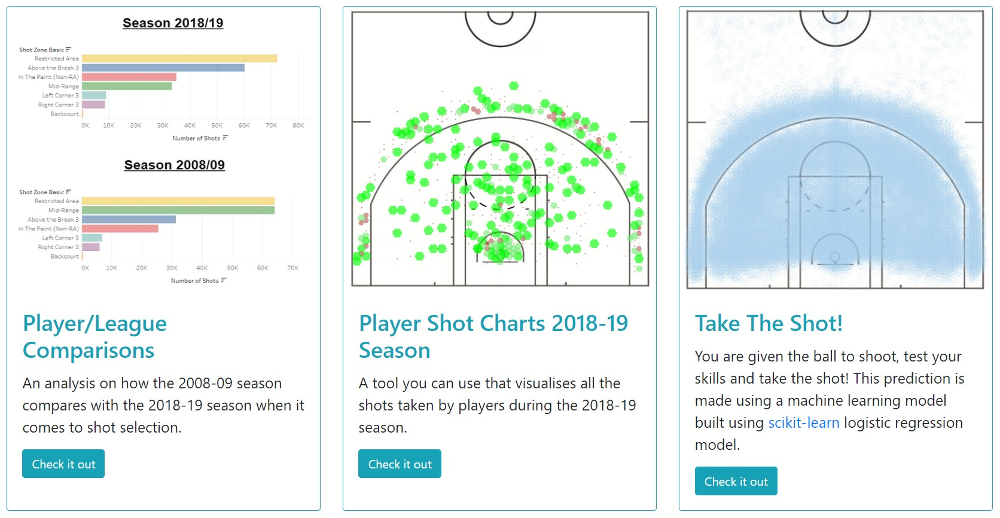
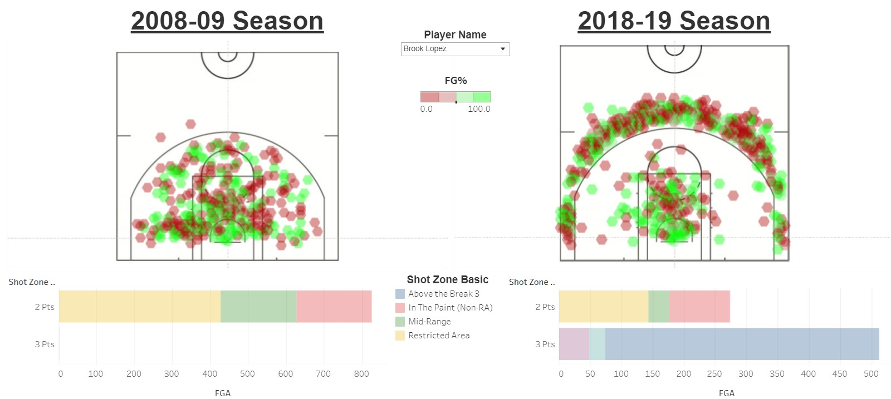
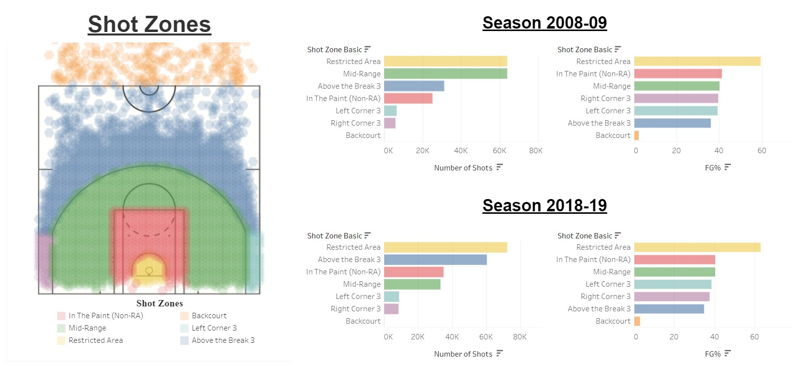
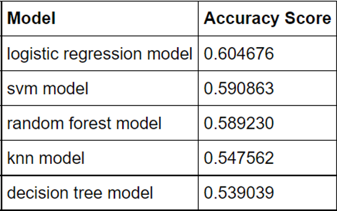
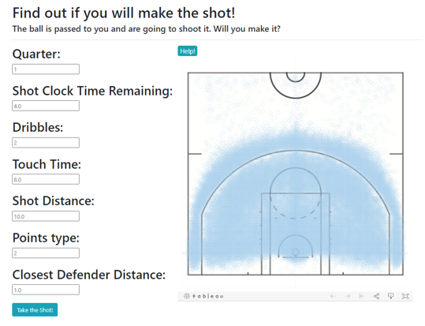
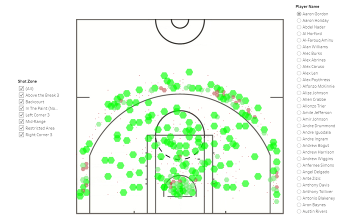

# NBA Shot Analysis: 2008-09 vs 2018-19 Season

Ever since 1891, basketball has continued to evolve, with new strategies being developed every era by the best teams. With the introduction of the three-point shot in 1979, one way the game has evolved is the increase in volume of three-point shots compared to the traditional two-pointer. But when did this occur? The transition towards a three-point era has been a rather recent development, with players like Stephen Curry and James Harden being pivotal influencers in this time. So how has the volume of two-point to three-point shots changed? Click below to find out more on how players and the league has changed from the 2008-09 season to the 2018-19 season.

Final Deployment: https://nba-shot-analysis-al001.herokuapp.com/


## Assignment structure
```
project
|
|__ data_preparation/        # contains notebooks used for data wrangling
|
|__ models/                  # contains machine learning models created for prediction
|  
|__ resources/               # contains raw and cleaned csv datasets
|
|__ static/                              
|         |_ css/            # contains css styling sheet
|         |_ images/         # contains images used in website
|         |_ js/             # contains logic to make prediciton using machine learning model, Tippy.js logic
| 
|__ tableau/                 # contains tableau dashboards used in final app
|
|__ templates/               # contains html files used to render each page
|
|__ .gitignore               # gitignore file
|
|__ NBA shot analysis.pptx   # final presentation slides
|
|__ Procfile                 # Heroku usage
|
|__ README.md                # Readme file
|
|__ app.py                   # python file to start local server
|
|__ requirements.txt         # Lists requirements needed by Heroku
```

## Usage

Dependencies and Setup
```
pip install -U scikit-learn
pip install joblib
pip install flask
```

## Data Sources:

|No|Source|Link|
|-|-|-|
|1|Kaggle|https://www.kaggle.com/dansbecker/nba-shot-logs|
|2|NBA API|https://github.com/swar/nba_api/blob/master/docs/nba_api/stats/endpoints/shotchartdetail.md|


## JS Libraries Used
|Source|Link|
|-|-|
|Tippy JS|https://atomiks.github.io/tippyjs/|

## Flask App Creation
### Flask Setup
```
from flask import Flask, request, render_template, jsonify
import joblib
import numpy as np
from sklearn.linear_model import LogisticRegression

app = Flask(__name__)
```

### Page Route Setup
```
@app.route("/")
def homepage():
    return render_template("index.html")
```

### Machine Learning Input With Prediction Setup
```
# allow the use of POST request with methods=["POST"]
@app.route("/api/predict", methods=["POST"])
def predict():
    if request.method == "POST":
        x_values = request.get_json()
        model = joblib.load("./models/logistic_regression_model.sav")
        prediction_values = [[
                int(x_values['period']),
                float(x_values['shot_clock']),
                int(x_values['dribbles']),
                float(x_values['touch_time']),
                float(x_values['shot_dist']),
                int(x_values['pts_type']),
                float(x_values['close_def_dist'])
            ]]
        

        prediction = model.predict(np.array(prediction_values).tolist()).tolist()

        # return the predicted result
        return jsonify({"prediction": prediction})
```

## How has player shot selection changed compared to 10 years ago?

- Players are transitioning towards 3-point shot more
- Notable players to compare: Brook Lopez, Marc Gasol, Kevin Love, Al Horford and Trevor Ariza
- Brook Lopez only had 2 three-point attempts during 2008 season, compared to over 500 attempts during 2018 season
- Many players who have transitioned to shooting more 3 point shots are Centres (4/5 of the players listed above play Centre)


## Have shooting percentages gotten better? / How many more 3-point shots are attempted compared to 10 years ago?

- Contrast between the number of shots taken in the mid-range and above the break 3 between seasons
- Mid-range shots halve from 60 000+ attempts in 2008 to around 30 000 attempts in 2018
- Above the break 3’s follow inversely, with 30 000 attempts in 2008 to 60 000+ attempts in 2018
- Field goal percentages remain similar when comparing the two seasons
- Note that above the break 3’s FG% drops by ~1% despite the amount of attempts doubling


## Summary
- Players now tend to favour 3-point shots over mid-range shots
- Shooting percentages haven’t improved over the years
- Why do teams shoot more 3-point shots?
   - The team with more points at the end wins
   - The league average for 3-point shots is ~37% or 1.11 points per shot
   - For a 2-point shot to be worth 1.11 points per shot, players would have to shoot ~55% from 2-points range, which they currently do not


## Machine Learning
### Model Creation
```
selected_features = df.drop(["outcome", "game_clock"], axis=1)
X = selected_features
y = df["outcome"]
print(X.shape, y.shape)
```

### Model Training Split
```
from sklearn.model_selection import train_test_split

X_train, X_test, y_train, y_test = train_test_split(X, y, random_state=1)
```

### Logistic Model Creation
```
from sklearn.linear_model import LogisticRegression
classifier = LogisticRegression()
classifier
```

### Fitting and Training Model
```
classifier.fit(X_train, y_train)
```

### Saving Model
```
import joblib
filename = 'logistic_regression_model.sav'
joblib.dump(classifier, filename)
```

### Model Comparisons

- Using model.score() to determine accuracy of each model
- Logistic Regression Model used in final product

### Model Usage

- Takes user inputs --> Sends Jsonified data to Flask server --> Uses data to predict using Logistic Regression Model --> 
Sends prediction result back to user


## Additional Visuals

- An interactive chart showing the locations of shots taken by a player during the 2018-19 season
- Size and colour of markings are scaled by the FG% of the player at that location
- Chart is filterable by shot zone and player name

Final Version Commit: 17 September 2021  
Last Revision: 03 October 2022
